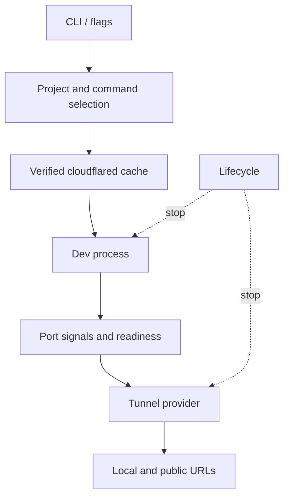
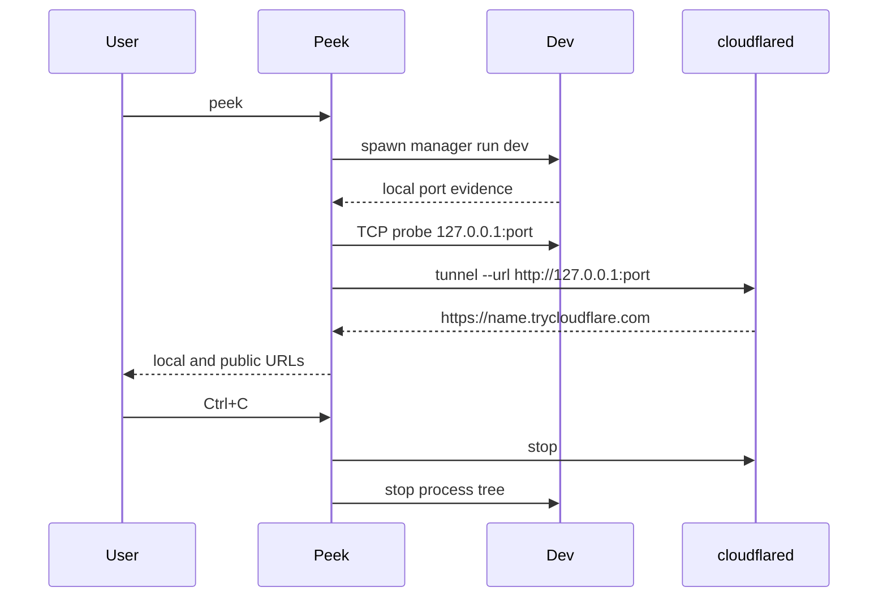

# Architecture

Peek is one Node.js CLI package. It owns two process trees: the project's dev
command and `cloudflared`. A single lifecycle object coordinates cancellation
and cleanup. No Peek server or configuration service exists in v0.1.

## Modules

| Module | Responsibility |
| --- | --- |
| `src/cli.ts` | Citty flags, alias, top-level errors, and UI wiring. |
| `src/core/project.ts` | Read local `package.json` and lockfiles only. |
| `src/core/dev-command.ts` | Build safe executable/argument arrays. |
| `src/core/process.ts` | Spawn and observe the dev process with Execa. |
| `src/core/port.ts` | Parse local output signals and probe loopback TCP. |
| `src/core/server.ts` | Reconcile output, child listeners, and newly opened common ports. |
| `src/core/run.ts` | Order startup and react to either process exiting. |
| `src/core/lifecycle.ts` | Signal handling, cancellation, and process-tree cleanup. |
| `src/cloudflared/*` | Fixed release mapping, download, checksum, and cache. |
| `src/tunnel/*` | Small provider contract and Cloudflare implementation. |
| `src/ui/*` | Compact output and terminal-size-aware QR rendering. |
| `src/utils/errors.ts` | Actionable error categories and formatting. |

## Execution lifecycle

1. Parse flags, inspect the current project, and select an argv array. An
   explicit command after `--` bypasses project inspection.
2. Verify or download the pinned `cloudflared` binary before starting the dev
   server. This avoids leaving a dev server running when tunnel preparation
   fails.
3. Snapshot common ports and an explicit `--port`, then spawn the dev command
   without a shell. Stream both output channels to the terminal and port
   detector.
4. Select one candidate port. `--port` wins. Otherwise, emitted local URLs,
   process-owned listeners, and newly opened common ports provide evidence.
   TCP readiness is checked at `127.0.0.1`. Conflicts fail closed.
5. The Cloudflare provider starts one Quick Tunnel to that exact loopback
   service. It resolves only after seeing a valid public HTTPS URL.
6. Keep both children alive. If either exits or the user sends SIGINT/SIGTERM,
   stop the tunnel first and then the dev process tree. Force termination after
   a short grace period.

The provider interface contains only `connect`, `disconnect`, and a connection
URL and exit promise. This keeps Cloudflare output parsing and process flags
out of server detection. Error objects carry a code, user message, and remedy;
the CLI prints causes only in verbose mode. The architecture is deliberately
small because v0.1 has one provider and one server at a time.
