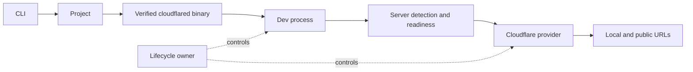

# Peek v0.1.0 design

Date: 2026-09-24
Status: approved design; implementation pending written-spec review

## Purpose and release boundary

Peek starts one project's development server, discovers the HTTP port it opened,
and exposes only that port through one temporary Cloudflare Quick Tunnel. The
installed command is `peek`; the npm package is `@radityprtama/peek`. Peek is an
ESM CLI for Node.js 22 or later, built from TypeScript in one repository and
licensed under MIT. A user account, configuration file, manual `cloudflared`
installation, or Bun runtime is not required.

The v0.1 release contains no Peek service, relay, account, telemetry, analytics,
dashboard, database, authentication, permanent hostname, or custom domain.

## User interface

| Invocation | Behavior |
| --- | --- |
| `peek` | Find the current project's `dev` script and run it. |
| `peek dev` | Alias for `peek`. |
| `peek --port 3000` | Run the dev script and select port 3000, subject to safety checks. |
| `peek --provider cloudflare` | Select the sole v0.1 provider. Other values fail with a useful error. |
| `peek --qr` / `peek --no-qr` | Request or suppress a terminal QR code. |
| `peek --verbose` | Show Peek and cloudflared diagnostic details. |
| `peek -- pnpm dev` | Run the tokenized command in the current directory instead of package discovery. |
| `peek --help` / `peek --version` | Print usage or package version without starting processes. |

The token sequence after `--` is passed to Execa as an executable and arguments.
Peek never evaluates it through a shell. This is the only explicit-command syntax
in v0.1; a string-based `peek run "pnpm dev"` would require shell-like parsing and
is excluded. Flags precede `--`. `--port` accepts an integer from 1 through
65535. The explicit command does not require `package.json`.

Normal terminal output consists of a compact title, a few progress lines, the
plain local and public URLs, and a Ctrl+C hint. Child framework output remains
visible. Peek's own verbose output must not print environment variables. QR
output contains the public HTTPS URL, uses compact rendering, and appears by
default only when stdout is a TTY and terminal dimensions can accommodate it.
`--qr` does not override an unusably small or noninteractive terminal; the plain
URL remains visible in every case.

## Project and command selection

Peek reads `package.json` and known lockfiles in the current working directory.
It does not search parent projects. An absent or unreadable `package.json`, a
missing `scripts.dev`, or an empty/nonstring dev script yields a distinct
actionable error unless an explicit command was supplied. It does not install
project dependencies.

Package manager priority is:

1. A supported `packageManager` name in `package.json` (`pnpm`, `npm`, `yarn`,
   `bun`), ignoring its version suffix.
2. Exactly one recognized manager indicated by `pnpm-lock.yaml`,
   `package-lock.json`, `yarn.lock`, `bun.lock`, or `bun.lockb`.
3. `npm` when there is no manager evidence.

Multiple conflicting lockfiles without a `packageManager` field cause an error
with guidance to set that field or remove stale lockfiles. An unsupported
declared manager causes an error. Peek uses `package-manager-detector` for its
manager-specific `run` command mapping, but determines the manager from local
evidence itself so upward directory search cannot select a parent project. A
missing executable yields a package-manager error that names the expected
command.

## Runtime boundaries

The runtime has six focused boundaries:

1. **CLI and UI** parse options, present progress, and format expected errors.
2. **Project** reads local package metadata and selects an argv array.
3. **Process and lifecycle** own the dev and tunnel child trees, signal handling,
   cancellation, exit observation, and cleanup.
4. **Server detection** gathers candidates, verifies a port, and waits for
   readiness.
5. **Tunnel provider** exposes a small `connect(port, signal)` /
   `disconnect()` contract and returns `{ url }`.
6. **Binary manager** chooses, downloads, verifies, and caches `cloudflared`.

Cloudflare details do not leak into project or server detection. Network and
process boundaries accept replaceable functions or executables so integration
tests can use fixtures without contacting Cloudflare.

## Startup and port selection

After parsing and project selection, Peek prepares the managed binary before
spawning the dev process, so a download or platform failure does not leave a
server running. It records whether an explicit port and common development
ports (3000, 3001, 4173, 4321, 5173, 5174, 8080) are occupied before
starting the dev command. The dev process uses Execa with the current working
directory, inherited environment, piped stdout and stderr, and no shell. Peek
consumes both streams as text without hiding framework errors.

Selection follows this order:

1. A valid explicit `--port` is authoritative. If it was occupied before the
   dev process started, Peek fails instead of exposing a pre-existing service.
2. Otherwise, parse HTTP URLs and port announcements from both child streams.
   Accept a unique output candidate only after it accepts TCP connections on
   `127.0.0.1`. Reject it if the prelaunch snapshot shows it was already open.
3. If output is absent or ambiguous, inspect listening sockets associated with
   the child tree using `/proc` on Linux, `lsof` on macOS, or `netstat` on
   Windows when available. A bounded check of common development ports may
   contribute candidates only if the port was closed before startup and is now
   reachable. Ambiguous candidates fail.

Port ownership checks are best effort across operating systems; Linux and
macOS are primary targets. Windows uses the available process inspection and
the same output/readiness checks. Peek never selects a port solely because it
is a common default. An output-derived port that was known to be occupied
before startup is rejected. If evidence is insufficient, Peek asks the user to
run with `--port`, rather than guessing. A silent server on a random port may
therefore need `--port`.

Readiness retries for at most 60 seconds against `127.0.0.1:<selected port>`.
A TCP listener is sufficient; Peek does not send a potentially state-changing HTTP
request. Tunnel connection has a separate 45-second deadline. A child exit or
user signal interrupts either wait immediately. No tunnel is started until
readiness succeeds.

## Cloudflare binary and tunnel

Cloudflare Quick Tunnel is the only provider in v0.1. Peek pins
`cloudflared` to version `2026.9.1` and supports Linux x64/ARM64, macOS
x64/ARM64, and Windows x64 where available. Platform mapping resolves to
fixed asset names and embedded SHA-256 digests from the official
[Cloudflare release](https://github.com/cloudflare/cloudflared/releases/tag/2026.9.1).
Downloads use HTTPS from that release, enforce a 100 MB size limit and
60-second deadline, verify the asset before use, and install atomically under
`~/.peek/bin/<platform>/cloudflared-2026.9.1` (with `.exe` on Windows).
macOS archive extraction selects only the binary after the archive checksum
passes; its extracted binary digest is then pinned in source. A cached binary
is checked against its pinned expected digest before execution. Interrupted or
invalid downloads leave no executable cache entry. Documentation explains the
cache path, version, trust source, removal, and third-party terms.

The provider starts the managed executable with argv equivalent to
`cloudflared tunnel --url http://127.0.0.1:<port>`. It reads both output
streams, accepts only a syntactically valid HTTPS URL whose host is one
subdomain of `trycloudflare.com`, and waits while the process remains alive.
It never reports success from a generic log line or before a valid URL is
found. Process exit, malformed output, startup timeout, cancellation, and
network failure produce distinct useful diagnostics. A user Cloudflare config
that prevents Quick Tunnels is reported with the documented remedy; Peek does
not modify that config.

Cloudflare says Quick Tunnels are for testing and development and do not offer
an uptime guarantee. A Peek URL exposes the selected service to anyone with
the URL while the tunnel runs. Peek does not add application authentication;
the URL's randomness is not an access control mechanism.

## Lifecycle and error behavior

One lifecycle owner registers SIGINT and SIGTERM handlers and owns a single
idempotent cleanup operation. It stops the tunnel first and then the dev
process tree, allowing a three-second grace period before forceful termination.
Execa's descendant termination is used where supported; Windows cleanup is
tested separately. A second termination signal accelerates forced cleanup.
Startup waits share a cancellation signal. On dev exit after connection, Peek
closes the tunnel; on tunnel exit, Peek closes the dev server. Normal Ctrl+C
returns the conventional interrupt status. Expected startup and tunnel errors
return nonzero without a stack trace. `--verbose` includes a cause and
diagnostic output without printing environment variables.

Expected error categories cover project discovery, dev script selection,
package manager execution, dev server startup, port detection, readiness,
binary installation, and tunnel connection. Messages state what happened and
one concrete next step.

## Verification and release

Vitest unit tests cover project inspection, manager precedence and conflicts,
argv selection, port and URL extraction, platform mapping, Cloudflare URL
parsing, and error formatting. Integration tests run a tiny fake project,
HTTP server, and tunnel executable to verify port selection, readiness,
early crashes, and child cleanup. No normal CI test opens a public tunnel.

Scripts include `dev`, `test`, `lint`, `typecheck`, and `build`. TypeScript uses
strict checks. Biome handles formatting and linting. tsdown produces a Node
ESM executable with a preserved shebang. CI runs lint, typecheck, tests, build,
and a tarball-installed CLI smoke test on Node 22 using `ubuntu-24.04`,
`ubuntu-24.04-arm`, `macos-15-intel`, `macos-15`, and `windows-2025`. An
additional Ubuntu x64 job tests Node 24. These labels are listed in the
[GitHub-hosted runners reference](https://docs.github.com/en/actions/reference/runners/github-hosted-runners).
Platform mapping tests cover every published asset.

README, `AGENTS.md`, `CHANGELOG.md`, `LICENSE`, and docs for architecture,
CLI, development, providers, security, troubleshooting, roadmap, and decisions
ship with the repository. A `v0.1.0` tag workflow reruns release checks and
publishes the public scoped npm package with provenance through npm trusted
publishing. The repository owner must connect that workflow as a trusted
publisher in npm before the first external publication; the repository cannot
perform that account action on their behalf. Release preparation is complete
only after local tests, build, package contents, executable smoke test, and
documented manual Cloudflare smoke steps pass.

## Sources checked during design

- [Citty command and flag documentation](https://github.com/unjs/citty)
- [Execa termination documentation](https://github.com/sindresorhus/execa/blob/main/docs/termination.md)
- [package-manager-detector documentation](https://github.com/antfu-collective/package-manager-detector)
- [Cloudflare Quick Tunnel documentation](https://developers.cloudflare.com/cloudflare-one/networks/connectors/cloudflare-tunnel/do-more-with-tunnels/trycloudflare/)
- [cloudflared 2026.9.1 release checksums](https://github.com/cloudflare/cloudflared/releases/tag/2026.9.1)
- [npm trusted publishing documentation](https://docs.npmjs.com/trusted-publishers)
